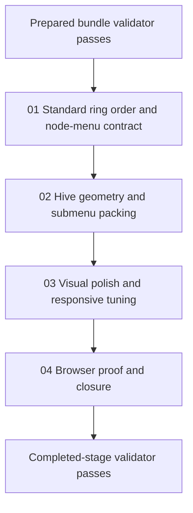

# Phase Plan

## Phase Sequence

1. Prepare and validate the bundle.
2. Implement the deterministic first-ring node ordering contract.
3. Implement the tighter hive geometry and submenu packing.
4. Tune visual density, readability, and responsive behavior in browser.
5. Record browser analytics, close raw notes, and run the completed-stage validator.

## Subbundle Dependency Map

- `01` and `02` are critical foundations. `03` may not start on design taste alone if the geometry still leaves visible spacing defects. `04` closes only after real browser proof.

## Critical Subbundles

- `01-01-standard-ring-order-and-node-menu-contract`
  - This phase defines the stable first ring and node-specific overflow ordering.
  - It needs focused automated proof because later browser screenshots assume the order is intentional.
- `02-02-hive-geometry-and-submenu-packing`
  - This phase defines whether the menu actually reads like a hive.
  - It needs live browser proof before visual polish may proceed, because screenshot quality depends on real spacing and submenu behavior.

## Phase Gates

- Gate after preparation: run the bundle validator and repair failures.
- Gate before each subbundle: confirm prerequisites are complete and still trusted.
- Gate after each UI-relevant subbundle: capture open-menu browser proof, review screenshots for density and overlap, and decide whether downstream work may continue.
- Gate before closure: rerun validators, close `N001` through `N008`, and reopen anything whose proof is weaker than the original complaint.
