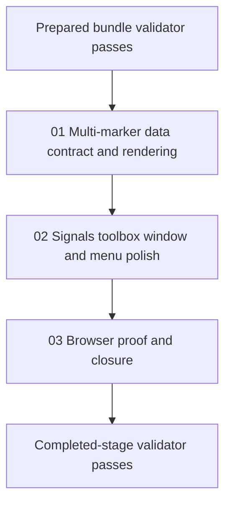

# Phase Plan

## Phase Sequence

1. Prepare and validate the bundle.
2. Implement the additive marker data contract and visible multi-marker rendering.
3. Implement the floating signals toolbox, toolbar trigger, and menu glyph polish.
4. Run browser proof, screenshot review, focused tests, and closure validation.

## Subbundle Dependency Map

## Critical Subbundles

- `01-01-multi-marker-data-contract-and-rendering`
  - This phase changes the behavior contract for markers and must be trusted before the toolbox can be validated.
- `02-02-signals-toolbox-window-and-menu-polish`
  - This phase is UI-heavy and includes overlay behavior plus the marker submenu visual fix.

## Phase Gates

- Gate after preparation: run the prepared-stage bundle validator and repair failures.
- Gate before subbundle `02`: confirm multi-marker storage and rendering already works in a focused proof path.
- Gate after each UI phase: capture open-state browser proof, review screenshots for clipping and readability, and record analytics.
- Gate before closure: rerun validators, close all raw notes, and reopen earlier phases if the browser proof reveals weak assumptions.
