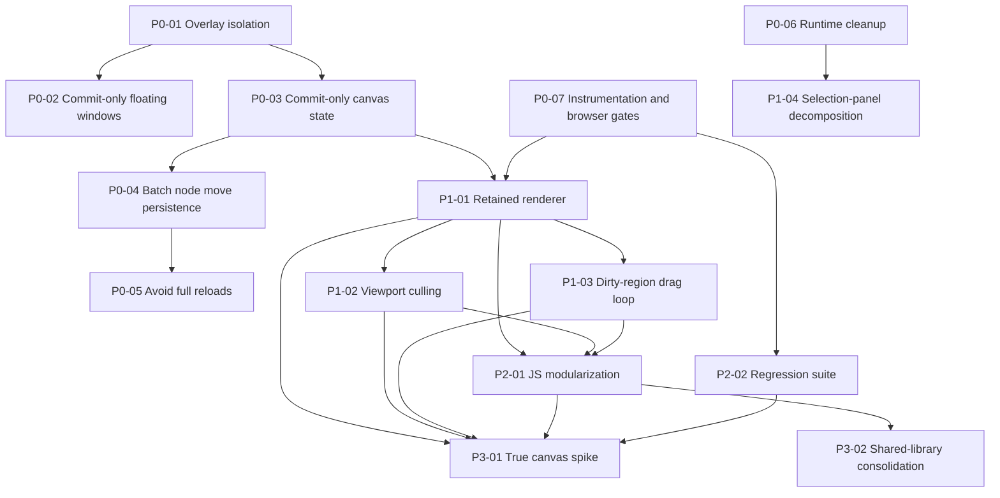

# Phase Plan

## Execution Order
- `P0-01` Overlay input isolation and wheel ownership
- `P0-02` Commit-only floating-window persistence
- `P0-03` Commit-only canvas state persistence and UI-state ownership cleanup
- `P0-04` Batch node-move persistence
- `P0-05` Avoid full surface reloads after simple mutations
- `P0-06` Runtime surface cleanup and support/demo separation
- `P0-07` Instrumentation and browser gates foundation
- `P1-01` Retained DOM/SVG renderer for nodes, links, and frames
- `P1-02` Viewport culling and filtered scene projection
- `P1-03` Dirty-region drag loop owned by JS
- `P1-04` Selection-panel decomposition and lazy expensive support surfaces
- `P2-01` Scene patch protocol and plain-JS modularization
- `P2-02` Dedicated screenshot and performance regression suite
- `P3-01` Optional true-canvas renderer spike
- `P3-02` Optional shared-library consolidation

## Subbundle Dependency Map

## Critical Subbundles
- `P0-01`: Interaction ownership foundation for every later browser proof.
- `P0-03`: Persisted versus live UI-state boundary; downstream performance claims depend on this being correct.
- `P0-07`: Counter and screenshot foundation; without it later evidence is weak.
- `P1-01`: Retained renderer baseline; later culling and dirty-region work depends on it.
- `P2-01`: Public JS API preservation and modular ownership boundary.

## Phase Gates
- `P0`: Do not proceed unless overlay interactions are isolated, hot-path persistence is reduced, and instrumentation exists for later measurements.
- `P1`: Do not proceed unless retained rendering is stable under create, delete, link, collapse, and drag flows.
- `P2`: Do not proceed unless browser regressions are localizable and the hot-path JS contract is explicit.
- `P3`: Treat as optional. Only proceed if earlier proof is strong enough to compare alternatives honestly.
