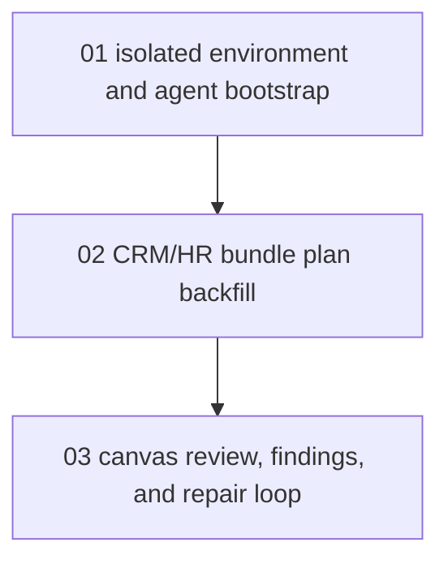

# Phase Plan

## Execution Order

1. `01` - isolated environment and agent bootstrap
2. `02` - CRM/HR bundle plan backfill
3. `03` - canvas review, findings, and repair loop

## Subbundle Dependency Map

## Critical Subbundles

- `01` is the critical foundation because every later step depends on a clean isolated database, a reachable local host, and a working MCP token.
- `02` is critical because an incomplete or weakly-structured backfill would make the final canvas review meaningless.
- `03` is critical because the user explicitly asked for management-grade readability and recorded findings, not only raw node creation.

## Phase Gates

- Prepared gate: `python scripts/validate_bundle.py <bundle-root> --stage prepared`
- Entry gate before `02`: isolated host running, fresh SQLite profile created, project-structure token generated, source bundle references trusted
- Entry gate before `03`: umbrella project and subprojects created, AI agents assigned, browser route reachable
- Closure gate after each subbundle: proof added to `reviews/01-execution-report.md`
- Final closure gate: `python scripts/validate_bundle.py <bundle-root> --stage completed`
