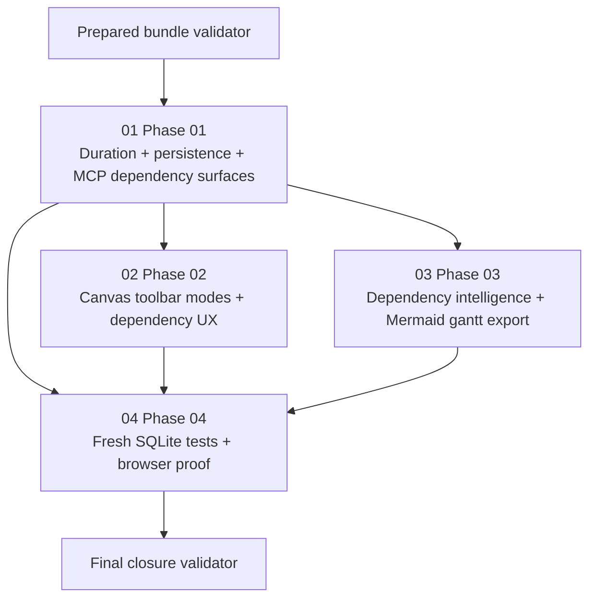

# Phase Plan

## Execution Order

1. Execute Phase 01 to add explicit duration support, dependency-centric persistence or service contracts, and MCP-ready dependency surfaces.
2. Execute Phase 02 to add the toolbar tool cluster, dependency authoring mode, delete mode, hover or highlight behavior, and link deletion semantics in the canvas.
3. Execute Phase 03 to add dependency-analysis services and Mermaid Gantt export behavior that reuse the same graph semantics.
4. Execute Phase 04 to seed a fresh SQLite scenario, extend automated tests, and capture Playwright MCP proof plus screenshots.
5. Finish with the final closure audit and validator reruns.

## Subbundle Dependency Map

- Phase 01 is the foundation for both the UI and export workstreams.
- Phase 04 is the closure gate because it validates the final user workflow against the requested fresh SQLite path.

## Critical Subbundles

| Critical phase | Why critical | Minimum progression proof |
| --- | --- | --- |
| Phase 01 | Defines duration storage, dependency graph semantics, deletion API surface, and MCP-facing contracts. If wrong, UI and export behavior will disagree or require rework. | Targeted build or test proof plus traceability review showing the graph and duration contracts are complete. |
| Phase 02 | Defines the user-visible authoring and delete behavior. If wrong, later browser proof cannot claim the requested UX is delivered. | Component or runtime and targeted browser proof that tool state, preview, drag coexistence, and delete highlights are behaving correctly. |
| Phase 03 | Defines the reusable dependency-analysis and Mermaid scheduling logic. If wrong, future Gantt or MCP consumers will be based on contradictory graph rules. | Deterministic tests proving readiness and Mermaid export use the same dependency interpretation and default duration behavior. |

## Phase Gates

| Gate | Rule | When it applies |
| --- | --- | --- |
| Prepared bundle gate | Run `validate_bundle.py --stage prepared` and repair any structural issue. | Before Phase 01 starts. |
| Phase 01 closure gate | Dependency persistence, duration field, unlink or delete-link surface, and MCP-facing contracts compile and are covered by targeted tests. | Before Phases 02, 03, or 04 start. |
| Phase 02 closure gate | Toolbar tools, preview, drag coexistence, and delete semantics are validated well enough that browser proof can focus on integration rather than basic behavior. | Before Phase 04 can claim final UI closure. |
| Phase 03 closure gate | Dependency readiness and Mermaid export are deterministic and share the same graph semantics used elsewhere. | Before final completion is claimed. |
| Phase 04 closure gate | Fresh SQLite seed data, automated tests, Playwright interactions, screenshots, and written screenshot findings are all logged in the execution report. | Before final completion is claimed. |
| Final closure gate | Run final validation, close raw notes, and reopen any phase with weak or inconsistent proof. | End of execution. |
