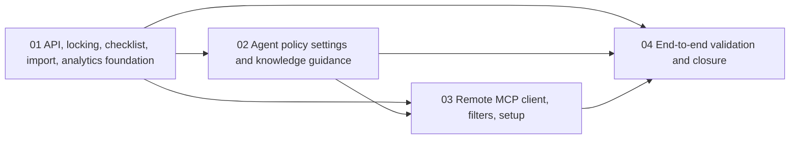

# Phase Plan

## Execution Order

1. Build the central API, shared contracts, central lease service, checklist service, asset revision flow, import seam, and analytics foundation.
2. Add workspace-hosted agent policy settings, knowledge guidance, and setup-snippet generation in CanDoItAll web.
3. Build the new `CanDoItAll.Mcp.ProjectStructure` stdio client plus cross-machine settings and reinstall flow.
4. Run end-to-end validation, browser proof, analytics review, and raw-note closure.

## Subbundle Dependency Map

## Critical Subbundles

- `01-central-project-structure-agent-api-locking-checklist-import-and-analytics-foundation`
  - Critical foundation because every later phase depends on stable contracts, central lease semantics, and trustworthy checklist behavior.
- `02-agent-policy-settings-and-knowledge-guidance-in-candoitall-web`
  - Critical foundation because permission and approval enforcement must be centrally configured before the client can be trusted on multiple machines.
- `03-remote-project-structure-mcp-client-filters-and-cross-machine-setup`
  - Critical execution bridge because it proves the remote-workstation model instead of a main-machine-only implementation.

## Phase Gates

| Subbundle | Entry gate | Closure gate | Downstream dependency unlocked |
| --- | --- | --- | --- |
| `01` | Bundle is ready and the repo references are still accurate. | Automated tests prove central contracts, lease conflicts, checklist propagation, and asset revision behavior. | `02`, `03`, and `04` may proceed. |
| `02` | `01` proof is trusted and the central policy model is stable. | Browser proof shows the settings UI can manage agent policy and generate usable setup guidance. | `03` may consume the shipped settings schema; `04` may rely on UI guidance proof. |
| `03` | `01` and `02` both passed their closure gates. | MCP integration tests prove real filtered reads and mutations against the central web API, and setup scripts/config output are updated. | `04` may run the final real-world validation chain. |
| `04` | `01` through `03` are complete and no critical proof is weak. | Real end-to-end validation, browser analytics review, and raw-note closure show the initiative actually works. | Bundle may close. |
