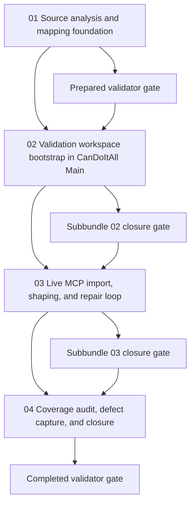

# Phase Plan

## Phase Sequence

1. Analyze the supplied XMind package, produce reusable source-analysis artifacts, and lock the node-type mapping rules.
2. Run the readiness gate and stop if the bundle still contains weak dependency or proof contracts.
3. Bootstrap the live validation workspace under `CanDoItAll Main`, including lease proof and source-asset capture.
4. Run the raw XMind import and then shape the imported data into richer project and node structures.
5. Capture browser, checklist, analytics, and raw-note closure proof before running the final closure gate.

## Subbundle Dependency Map

- Subbundle 01 and subbundle 02 are the live-validation foundations. Downstream work cannot borrow trust if either closes with weak proof.

## Critical Subbundles

- `01-source-analysis-and-project-structure-mapping-foundation` is a critical foundation because every later mutation depends on correct semantic mapping and valid source packaging.
- `02-validation-workspace-bootstrap-in-candoitall-main` is a critical foundation because later mutation, defect capture, and browser proof all depend on working lease acquisition and a real validation workspace.
- `03-live-mcp-import-shaping-and-repair-loop` is the main behavior proof phase and must close with both MCP readback and browser-visible confirmation before closure work may begin.

## Phase Gates

- After preparation: run `validate_bundle.py --stage prepared` and repair the bundle until it passes.
- Before each subbundle: confirm prerequisites, source references, and dependency trust through the subbundle entry gate.
- After subbundle 02: do not continue unless project linkage, lease proof, and source capture all succeeded on the live app.
- After subbundle 03: do not continue unless created structure is readable through the MCP and visible through the browser.
- Before closure: rerun bundle validation, reconcile raw-note closure, and capture any unresolved defects honestly instead of deferring them silently.
