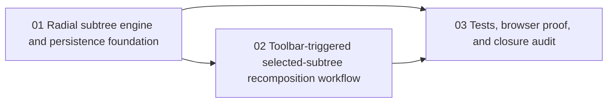

# Phase Plan

## Execution Order

1. Add the subtree recomposition engine and a service-level persistence seam that can reposition a selected subtree deterministically and collision-free.
2. Add the manual toolbar workflow on the project structure page and wire it to the selected-node scope plus feedback and reload behavior.
3. Close the change with targeted automated tests, browser validation, screenshot review, analytics capture, and raw-note closure.

## Subbundle Dependency Map

## Critical Subbundles

- `01-subtree-radial-layout-engine-and-persistence-foundation`
  Critical foundation because the toolbar command is only trustworthy if the service computes stable, persisted, collision-free coordinates.
- `02-toolbar-triggered-selected-subtree-recomposition-workflow`
  Critical UI foundation because the user explicitly requested a toolbar command with selection-scoped behavior and no hidden automation.

## Phase Gates

| Subbundle | Entry gate | Closure gate | Downstream dependency unlocked |
| --- | --- | --- | --- |
| `01` | Bundle readiness gate passed and the current source references still match the repo. | Targeted service or unit proof shows deterministic subtree placement, persisted coordinates, and no overlap against fixed obstacles in representative graphs. | `02` and `03` may proceed. |
| `02` | `01` is trusted and exposes a stable recomposition seam. | Component proof plus browser proof show the toolbar button recomposes only the selected subtree, preserves graph structure, and renders without visual collisions. | `03` may proceed. |
| `03` | `01` and `02` are complete and no critical proof is still weak. | Final test run, browser analytics, screenshot review, and raw-note closure all confirm the request is solved. | Bundle may close. |
