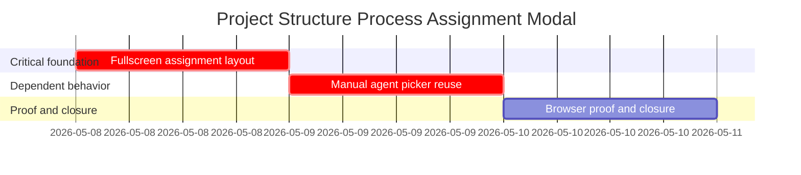

# Phase Plan

## Phase Sequence

1. Subbundle 01 creates the full-screen staffing modal layout and visual states while preserving the existing launch-plan lifecycle.
2. Subbundle 02 connects manual `Assign agent` and `Change agent` actions to the existing agent switcher and persists the chosen agent.
3. Subbundle 03 runs tests and browser validation, captures screenshots, audits raw-note closure, and finalizes the bundle.

## Subbundle Dependency Map

## Critical Subbundles

- `01-01-fullscreen-assignment-layout` is a critical foundation because all browser proof and manual assignment actions depend on the modal shell, role cards, and stable test ids.
- `02-02-manual-agent-picker-reuse` is a critical foundation for closure because it owns the literal manual-agent requirement.
- `03-03-browser-proof-and-closure` is the final gate and must reopen earlier work when screenshots or tests contradict the design.

## Phase Gates

- Prepared gate: run `python codex\skills\bundles\candoitall-bundle-preparation\scripts\validate_bundle.py --stage prepared project-structure-process-assignment-modal-bundle` and manually check input coverage.
- Entry gate for subbundle 01: exact source references exist and the current staffing dialog is still rendered by `ProjectStructureCanvasDialogs`.
- Closure gate for subbundle 01: component tests or build pass and local screenshot/DOM proof show a full-screen modal structure.
- Entry gate for subbundle 02: subbundle 01 is complete and `AgentSwitchDialog` behavior remains covered by existing tests.
- Closure gate for subbundle 02: selecting a manual agent either selects an existing launch candidate or creates/selects a safe persisted candidate, with tests.
- Final closure gate: targeted tests and browser screenshots pass; execution report contains browser analytics, screenshot review, and raw-note closure.
