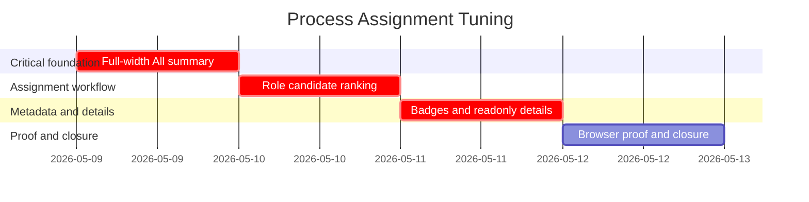

# Phase Plan

## Phase Sequence

1. Subbundle 01 fixes full-width content usage and adds the `All` rail summary mode.
2. Subbundle 02 creates role-specific assignment mode, candidate ordering, and the final plus-card manual picker entry.
3. Subbundle 03 enriches candidates from the agent catalog and adds model/tools/skills/details badges plus readonly details dialog.
4. Subbundle 04 runs tests, build, browser proof, screenshot review, raw-note closure, and final bundle validation.

## Subbundle Dependency Map

## Critical Subbundles

- `01-full-width-all-summary` is critical because every screenshot and interaction is evaluated inside this shell.
- `02-role-specific-candidate-ranking` is critical because it owns the distinction between assignment and review.
- `03-agent-metadata-badges-details` is critical because it changes mapped candidate data and visible agent-card semantics.
- `04-browser-proof-and-closure` is the final gate and must reopen earlier subbundles when proof contradicts the design.

## Phase Gates

- Prepared gate: run `python codex\skills\bundles\candoitall-bundle-preparation\scripts\validate_bundle.py --stage prepared project-structure-process-assignment-tuning-bundle`.
- Entry gate for subbundle 01: current fullscreen assignment component and CSS are inspected.
- Closure gate for subbundle 01: `All` rail item exists and summary mode renders all role cards.
- Entry gate for subbundle 02: subbundle 01 closure passes.
- Closure gate for subbundle 02: multiple candidate ordering and plus-card picker callback are tested.
- Entry gate for subbundle 03: candidate rendering has stable badge locations.
- Closure gate for subbundle 03: metadata mapping, tooltip badges, and readonly details dialog are tested.
- Final closure gate: targeted tests, build, screenshots, proof JSON, execution report, and completed-stage validator pass.
