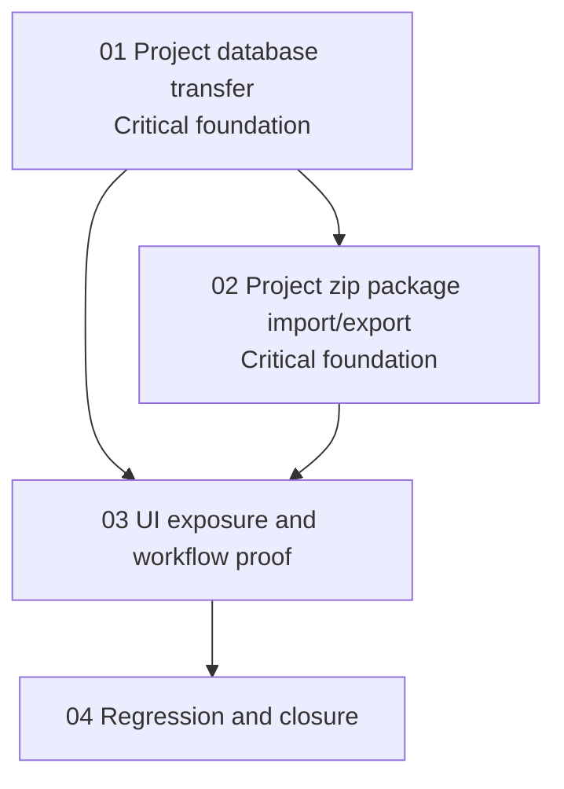

# Phase Plan

## Phase Sequence

1. `01-project-database-transfer`: implement and prove the shared project database transfer foundation.
2. `02-project-zip-package-import-export`: implement project zip export/import using the same inventory and copy rules.
3. `03-ui-exposure-and-workflow-proof`: expose zip controls on Projects and prove existing database transfer UI surfaces the new `Projects` item.
4. `04-regression-and-closure`: run targeted build/tests, browser proof, raw-note closure, and final bundle validation.

## Subbundle Dependency Map

## Critical Subbundles

- `01-project-database-transfer` is a critical foundation. If it misses a project table or clears in the wrong order, zip import/export and UI transfer proof are not trustworthy.
- `02-project-zip-package-import-export` is a critical foundation for the zip half of the user's request. It must prove export and import, not only package creation.

## Phase Gates

- Preparation gate: run `scripts/validate_bundle.py --stage prepared` and manually audit input coverage before implementation.
- `01` entry: source references exist and the scoped table inventory is accepted. Closure: integration test proves profile-to-profile project transfer with structure data.
- `02` entry: `01` is complete. Closure: package integration test proves export/import into an empty target profile, including table counts and package existence.
- `03` entry: `01` and `02` are complete. Closure: component tests plus Playwright browser proof show transfer item and zip controls.
- `04` entry: all prior closure gates passed. Closure: targeted tests/build pass, browser analytics are reviewed, raw notes are closed, and final bundle validation passes.
