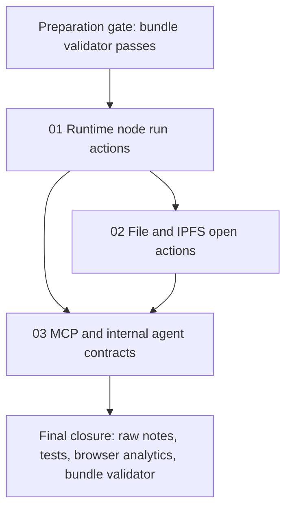

# Phase Plan

## Phase Sequence

1. Prepare and validate this bundle with the raw-note coverage matrix and source references.
2. Execute `01-runtime-node-run-actions`: add runtime normal/admin actions to quick-action and right-click flows, then prove UI and host-action dispatch wiring.
3. Execute `02-file-and-ipfs-open-actions`: add local-drive and IPFS/new-tab offers to quick-action and context flows, then prove local-vs-IPFS action visibility.
4. Execute `03-mcp-and-internal-agent-action-contracts`: expose the shared node action capability contract through Project Structure MCP and internal agent tools.
5. Run the raw-note closure audit, analytics review, targeted tests, and final bundle validator.

## Subbundle Dependency Map

## Critical Subbundles

- `01-runtime-node-run-actions` is a critical UI and host-action foundation. It establishes the shared approach for multiple actions per quick-action dialog and context menu.
- `02-file-and-ipfs-open-actions` is a critical host/browser-action foundation for file nodes and must reuse the same action visibility model.
- `03-mcp-and-internal-agent-action-contracts` is dependent on the final capability semantics from subbundles 01 and 02.

## Phase Gates

- Gate after preparation: run `python C:/Users/dell/.codex/skills/candoitall-bundle-preparation/scripts/validate_bundle.py C:/repositories/CanDoItAll/project_structure_node_actions_bundle --profile feedback --stage prepared` and complete the manual readiness audit.
- Gate before subbundle 01: exact runtime source references exist; `N001` and `N002` still map to this subbundle; runtime launcher tests are identified.
- Gate after subbundle 01: runtime nodes show normal/admin actions in double-click modal and context menu; targeted tests pass; browser analytics include open modal and open context-menu evidence.
- Gate before subbundle 02: subbundle 01 is completed or honestly blocked; local file and IPFS detection source references still match the repo.
- Gate after subbundle 02: local file nodes show File Explorer; IPFS nodes show new-tab open; targeted tests pass; browser analytics include open modal/context menu evidence for file behavior.
- Gate before subbundle 03: subbundles 01 and 02 capability semantics are stable; contract changes are backward-compatible enough for compact reads.
- Gate after subbundle 03: Project Structure MCP and internal agent compact nodes include action capability metadata; targeted MCP/internal-tool tests pass.
- Gate before closure: execution report has subbundle gate rows, browser-validation analytics rows, raw-note closure rows, and final validator passes.
