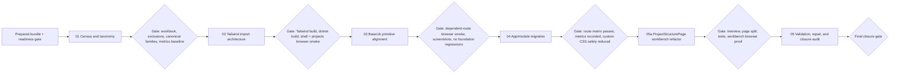

# Phase Plan

## Phase Sequence

1. Run the readiness gate on the prepared bundle.
2. Execute subbundle `01` to establish the Excel census, canonical families, exclusions, and progress baseline.
3. Execute subbundle `02` to restructure Tailwind imports and prove the new component-layer foundation in a real browser.
4. Execute subbundle `03` to align BaseLib primitives and smoke-test dependent routes before any wide page migration.
5. Execute subbundle `04` to migrate high-churn pages and safe custom-CSS hotspots using the proven shared system.
6. Execute subbundle `05a` to refactor the deferred `ProjectStructurePage` workbench surface onto shared components and prove the new toolbox and detail patterns.
7. Execute subbundle `05` for route sweep, screenshot review, regression repair, raw-note closure, and final bundle closure.

## Subbundle Dependency Map

## Critical Subbundles

- `01 Tailwind style census and canonical taxonomy`
- This is a critical foundation because it defines what will be unified, what is excluded, and how progress will be measured. Downstream work is weak if the census is incomplete.
- `02 Tailwind component layer architecture and shared CSS imports`
- This is a critical foundation because it establishes the shared styling source of truth. Every later migration depends on it compiling correctly and rendering without shell regressions.
- `03 BaseLib primitive alignment and wrapper expansion`
- This is a critical UI foundation because downstream pages should consume these primitives rather than keep inventing page-level markup styles. It requires one dependent-route smoke before downstream work continues.

## Phase Gates

- After preparation: run `validate_bundle.py --stage prepared` and keep repairing until the bundle passes.
- Before each subbundle: confirm prerequisites, source references, exclusion boundaries, and prior proof still hold.
- After subbundle `01`: require the Excel workbook, top repeated-family list, explicit canvas exclusion list, and baseline progress metrics.
- After subbundle `02`: require `Tailwind` build success, `dotnet build`, and a large-screen Playwright smoke on shell-level routes before continuing.
- After subbundle `03`: require one dependent-route browser smoke in addition to the immediate component checks because later migrations depend on these primitives.
- After subbundle `04`: require large-screen and narrower-width screenshots on all migrated routes and recorded progress metrics.
- After subbundle `05a`: require a focused `ProjectStructurePage` test pass, workbench browser proof for the toolbox and detail windows, and explicit confirmation that canvas behavior was preserved while only the non-canvas surfaces were refactored.
- Before closure: rerun validators, answer the step `0` questions against facts, reopen weak earlier phases if needed, and do not treat missing browser proof as acceptable risk.
