# Phase Plan

## Phase Sequence

1. Run the readiness gate on the repaired bundle.
2. Execute subbundle `01` to define the theme contract, scope boundaries, and public-API position.
3. Execute subbundle `02` to challenge that architecture from QA/Tailwind and repair any weak assumptions before code changes.
4. Execute subbundle `03` to add the semantic Tailwind token foundation, built-in light/dark themes, and the runtime theme host.
5. Execute subbundle `04` to move BaseLib primitives and shared CSS families onto the new theme contract.
6. Execute subbundle `05` to migrate route and module hotspots that still bypass the shared contract.
7. Execute subbundle `06` to stabilize prefixes around `cad-*` with compatibility selectors where needed.
8. Execute subbundle `07` for runtime switching proof, route sweep, raw-note closure, and Zyphonote compatibility confirmation.

## Subbundle Dependency Map

```mermaid
flowchart LR
    B0["Prepared bundle + readiness gate"] --> S1["01 Architecture contract"]
    S1 --> G1{"Gate: semantic contract, scope map, rejected alternatives"}
    G1 --> S2["02 Architecture QA challenge"]
    S2 --> G2{"Gate: concerns repaired, no weak override path"}
    G2 --> S3["03 Tailwind token foundation + host"]
    S3 --> G3{"Gate: Tailwind build, runtime host, theme scopes compile"}
    G3 --> S4["04 BaseLib primitive adoption"]
    S4 --> G4{"Gate: component build/tests plus dependent UI smoke"}
    G4 --> S5["05 Route hotspot migration"]
    S5 --> G5{"Gate: route screenshots and hotspot reduction"}
    G5 --> S6["06 Prefix stabilization + compatibility"]
    S6 --> G6{"Gate: cad canonical, aliases verified, no route regressions"}
    G6 --> S7["07 Runtime proof + closure audit"]
    S7 --> G7{"Final closure gate"}
```

## Critical Subbundles

- `01 Architecture contract and scope model`
- This is a critical foundation because it defines the token contract, scope boundaries, and whether the public API stays strongly typed.
- `02 Architecture QA challenge and repair`
- This is a critical foundation because it decides whether the chosen override and prefix strategy is actually safe to implement.
- `03 Tailwind theme token foundation and host`
- This is a critical UI foundation because later primitive and route proof is meaningless if the shared token layer is wrong.
- `04 BaseLib component tone and radius adoption`
- This is a critical UI foundation because route-level cleanup must depend on shared primitives instead of new page-local styling.

## Phase Gates

- After preparation: run `validate_bundle.py --stage prepared` and repair until it passes.
- After subbundle `01`: require a written theme contract, explicit scope boundaries, and an explicit rejection of shorthand public tone strings.
- After subbundle `02`: require a documented QA challenge result and repaired architecture before code changes continue.
- After subbundle `03`: require Tailwind build success, visible runtime theme host behavior, and one real theme-scope smoke before later work starts.
- After subbundle `04`: require solution build, focused tests where practical, and one dependent-route smoke proving primitives actually pick up the shared tokens.
- After subbundle `05`: require large-screen and narrower-width screenshots on the chosen route matrix and recorded hotspot reduction notes.
- After subbundle `06`: require proof that `cad-*` is canonical on changed shared surfaces and that compatibility aliases kept dependent routes stable.
- Before closure: rerun validators, prove runtime theme switching on a rendered surface, complete the raw-note closure table, and record the Zyphonote compatibility audit without hiding any missing proof.
