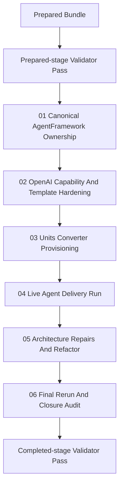

# Phase Plan

## Phase Sequence

1. Run the prepared-stage bundle validator and repair bundle-quality failures before code or runtime work starts.
2. Execute `01-canonical-agentframework-ownership-and-crm-hr-projection` to eliminate the source-of-truth split and prove both UI surfaces resolve the same technical-agent catalog.
3. Execute `02-openai-agent-capability-and-process-template-hardening` to harden OpenAI provider usage, delivery-agent instructions, Playwright capability, and reusable process-template composition.
4. Execute `03-units-converter-project-and-process-provisioning` to create the serious project, project structure, phases, roles, process attachments, and agent assignments in the requested profile.
5. Execute `04-live-agent-delivery-run-and-observation` to run the serious delivery path with a human approval role, capture runtime proof, and harvest real weaknesses from the observed flow.
6. Execute `05-execution-driven-architecture-repairs-and-refactor` to convert live-run findings into code, template, and architectural repairs, including file-splitting where justified.
7. Execute `06-final-rerun-and-closure-audit` to rerun the serious flow, verify closure evidence, rerun validators, and close every raw note with proof.

## Subbundle Dependency Map

## Critical Subbundles

- `01-canonical-agentframework-ownership-and-crm-hr-projection` is a critical foundation because every later step depends on a single editable agent catalog.
- `02-openai-agent-capability-and-process-template-hardening` is a critical capability foundation because the serious run is invalid if agents lack the right provider, instruction, Playwright, or screenshot-analysis setup.
- `03-units-converter-project-and-process-provisioning` is a critical delivery foundation because the later runtime proof is meaningless if the project structure, roles, or process attachments were provisioned incorrectly.

## Phase Gates

- Gate after preparation: run `validate_bundle.py --stage prepared` and repair any failure before implementation starts.
- Gate before each subbundle: confirm prerequisite proof is still valid, especially after runtime repairs or database reseeding.
- Gate after subbundles `01`, `03`, `04`, and `06`: record browser validation analytics with Playwright actions, screenshots, and visual review findings.
- Gate after subbundle `04`: freeze the observed weaknesses into the execution report before implementing repairs, so the later refactor is evidence-driven rather than speculative.
- Gate before closure: rerun targeted code validation, rerun the serious delivery flow, confirm project-structure artifact visibility, rerun the completed-stage validator, and only then mark raw notes closed.
