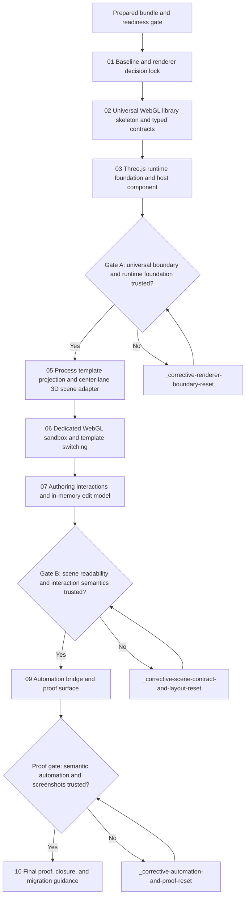

# Phase plan

## Phase Sequence

1. `01-baseline-and-renderer-decision-lock` — Baseline and renderer decision lock
2. `02-universal-webgl-library-skeleton-and-typed-contracts` — Universal WebGL library skeleton and typed contracts
3. `03-threejs-runtime-foundation-and-host-component` — Three.js runtime foundation and host component
4. `04-architecture-review-gate-a` — Architecture review gate A
5. `05-process-template-projection-and-2_5d-scene-adapter` — Process template projection and center-lane 3D scene adapter
6. `06-dedicated-webgl-sandbox-and-template-switching` — Dedicated WebGL sandbox and template switching
7. `07-authoring-interactions-and-in-memory-edit-model` — Authoring interactions and in-memory edit model
8. `08-architecture-review-gate-b` — Architecture review gate B
9. `09-automation-bridge-and-proof-surface` — Automation bridge and proof surface
10. `10-final-proof-closure-and-migration-guidance` — Final proof, closure, and migration guidance

Corrective playbooks are only executed when a gate or stop rule triggers them.

## Subbundle Dependency Map

## Critical Subbundles

- `02-universal-webgl-library-skeleton-and-typed-contracts` is the foundation for everything else. If it leaks Processes semantics, the architecture is wrong before the concept even renders.
- `03-threejs-runtime-foundation-and-host-component` is the runtime boundary control point. If per-frame work leaves JS, the concept will not scale to real interaction.
- `05-process-template-projection-and-2_5d-scene-adapter` is where the concept becomes repository-specific in the right way. If lane structure, role spread, or semantics drift here, the proof becomes misleading.
- `06-dedicated-webgl-sandbox-and-template-switching` is the first human-visible concept route and must be screenshot-ready.
- `07-authoring-interactions-and-in-memory-edit-model` is where the concept must prove authoring value, not just visual novelty.
- `09-automation-bridge-and-proof-surface` is the critical proof phase because WebGL cannot rely on screenshot-only validation.

## Phase Gates

- After preparation: run the prepared-stage bundle validator and fix every structural issue before execution.
- After subbundle 03: Gate A must explicitly approve the universal boundary, guided perspective default, DOM mirror, and runtime ownership before process projection begins.
- After subbundle 07: Gate B must explicitly approve readability, semantic projection, and sandbox-only editing before automation hardening begins.
- After subbundle 09: the proof gate must confirm semantic automation, screenshot export, and deterministic scene snapshots before final closure work proceeds.
- At final closure: build, targeted tests, screenshots, workbook updates, and migration rubric must all be fresh.
