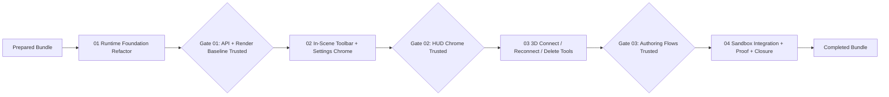

# Phase Plan

## Phase Sequence

1. Finish bundle preparation and run the readiness gate.
2. Execute `01-runtime-foundation-refactor-and-api-shaping`.
3. Run the closure gate for subbundle `01` and confirm the runtime API and render baseline are still trusted.
4. Execute `02-in-scene-toolbar-and-settings-chrome`.
5. Run the closure gate for subbundle `02` and confirm the stage-local chrome is real, readable, and ready for downstream authoring tools.
6. Execute `03-3d-connection-reconnection-and-delete-tools`.
7. Run the closure gate for subbundle `03` and confirm the authoring tools survive rerender and remain model-aware or honestly sandbox-local.
8. Execute `04-sandbox-integration-regression-proof-and-closure`.
9. Run the final raw-note closure audit, the completed-stage validator, and the browser analytics review.

## Subbundle Dependency Map

- If `02` proves the chrome layer is still HTML-first or visually weak, reopen `01` or `02` before allowing `03`.
- If `03` exposes weak edge-hit or command-routing foundations, reopen `01` or `02` before closing `03`.

## Critical Subbundles

- `01-runtime-foundation-refactor-and-api-shaping`
- Critical because every later phase depends on the split runtime, shared state, and public API remaining stable.
- Required deeper validation before downstream work continues:
- targeted .NET tests for interop/state
- live browser render on the sandbox route
- retained automation helpers (`getSceneSnapshot`, `getState`, `simulateDrag`, `simulateConnection`, export)

- `02-in-scene-toolbar-and-settings-chrome`
- Critical because the requested stage-local toolbar, settings, and context-menu foundation unblock the authoring tools in `03`.
- Required deeper validation before downstream work continues:
- open-state browser proof for the toolbar and settings/menu
- large-screen screenshot review
- explicit confirmation that the primary stage controls are no longer just the old HTML overlay

## Phase Gates

- Gate after preparation:
- run `python C:\Users\dell\.codex\skills\candoitall-bundle-preparation\scripts\validate_bundle.py webgl_workbench_runtime_refactor_bundle --profile initiative --stage prepared`
- manually review input coverage, dependency map, critical subbundles, and proof contract

- Gate before each subbundle:
- confirm the prerequisite subbundle statuses are `Completed`
- reopen any earlier critical foundation if current observations contradict its proof

- Gate after each subbundle:
- update `reviews/01-execution-report.md`
- record browser analytics while proof is fresh
- review screenshots for readability, overlap, clipping, hierarchy, and actual integration quality

- Gate before closure:
- rerun prepared validation if the bundle contract changed materially during execution
- run the completed-stage validator
- close raw notes `N001` through `N009` with explicit proof references
